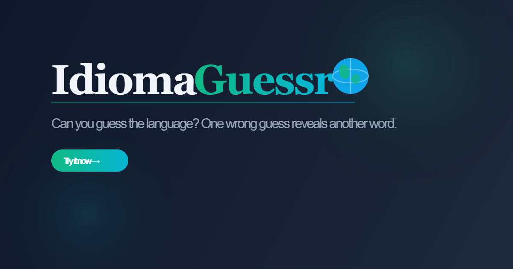

# IdiomaGuessr 🌍

Un jeu de devinette de langues : une phrase mystère est progressivement révélée à chaque tentative ratée. Saurez-vous identifier la langue avant d'avoir épuisé vos 5 essais ?

**[Jouer en ligne →](https://idoma-guessr.netlify.app/)**



---

## Comment jouer

1. Une phrase dans une langue étrangère est partiellement masquée
2. Devinez la langue — un nouveau mot se révèle à chaque mauvaise réponse
3. Des indices progressifs apparaissent : zone géographique (3e tentative), famille linguistique (4e tentative)
4. 5 tentatives max — enchaînez les victoires pour faire monter votre streak 🔥

## Fonctionnalités

- 20+ langues jouables avec drapeaux et autocomplétion
- Lecture audio de la phrase (Web Speech API)
- Indices progressifs (région, famille de langue)
- Streak de victoires consécutives avec animation
- Thème clair / sombre
- Entièrement responsive (mobile-first)

## Stack

| Outil | Rôle |
|---|---|
| React 19 + TypeScript | UI |
| Vite | Build & dev server |
| Tailwind CSS | Styles |
| Radix UI | Composants accessibles |
| Web Speech API | Lecture audio TTS |

## Lancer le projet

```bash
npm install
npm run dev
```

---

Projet personnel — portfolio [Arthur Ferjault](https://github.com/aferjault)
