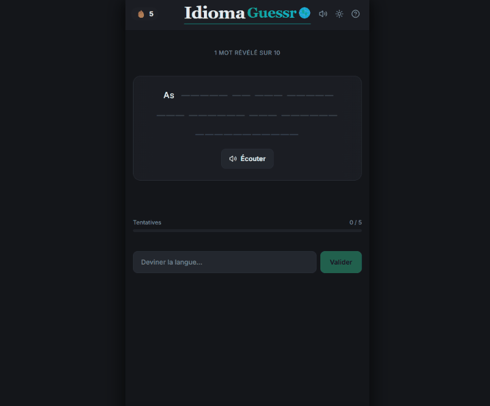

# IdiomaGuessr 🌍

Jeu de devinette de langues. 
Une phrase dans une langue étrangère est progressivement révélée, à chaque tentative ratée, un mot supplémentaire apparaît. 
**Tu as 5 essais pour trouver la langue !**

## Démo

🔗 **[idioma-guessr.netlify.app](https://idioma-guessr.netlify.app/)**



## Fonctionnalités

- **Révélation progressive** : les mots se dévoilent un à un à chaque mauvaise réponse
- **57 langues** jouables avec drapeaux et autocomplétion
- **Indices progressifs** : zone géographique (tentative 3), famille linguistique (tentative 4)
- **Lecture audio** de la phrase via [ElevenLabs](https://elevenlabs.io) (modèle Eleven v3) avec fallback Web Speech API
- **Streak** : compteur de victoires consécutives avec animation
- **Thème clair/sombre**
- **Effets sonores** activables/désactivables
- **Phrases réelles** issues de l'API [Tatoeba](https://tatoeba.org)

## Stack

| Outil                      | Rôle                        |
| -------------------------- | --------------------------- |
| React 19 + TypeScript      | UI                          |
| Vite                       | Build & dev server          |
| Tailwind CSS               | Styles                      |
| Radix UI                   | Composants accessibles      |
| flag-icons                 | Drapeaux CSS                |
| Tatoeba API                | Source des phrases          |
| ElevenLabs API (Eleven v3) | Synthèse vocale multilingue |

## Installation

```bash
git clone https://github.com/aferjault/idioma-guessr.git
cd idioma-guessr
npm install
npm run dev
```

Ouvrir [http://localhost:5173](http://localhost:5173) dans le navigateur.

## Scripts

```bash
npm run dev      # Serveur de développement
npm run build    # Build de production
npm run preview  # Prévisualiser le build
npm run lint     # ESLint
```

## Licence

MIT
